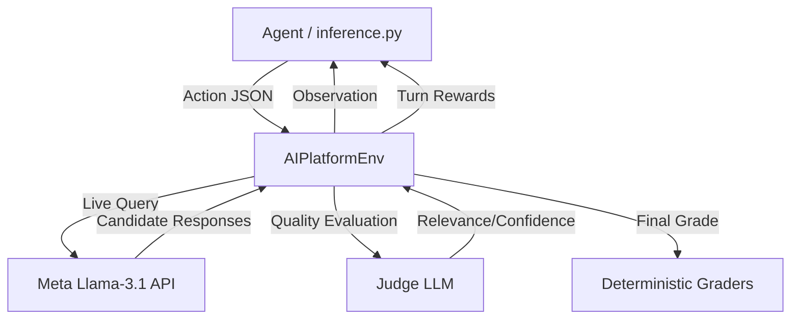

# AIPlatformEnv

> An [OpenEnv](https://github.com/openenv)-compatible benchmark for evaluating AI agent interactions with model platforms.

---

## Motivation

Evaluating how well an AI agent can *use* another AI system is a critical frontier for agentic AI. AIPlatformEnv provides a production-grade testbed where agents must:

- **Plan Research Tasks**: Structure non-linear workflows before execution.
- **Iterative Querying**: Refine searches when initial results are insufficient.
- **Critical Evaluation**: Multilaterally compare candidate responses and assign precise quality ratings.

The environment utilizes real **Llama-3.1 models** and an **AI-driven Judge system** to ensure all performance metrics are authentic and non-heuristic.

---

## Features
- **Real-World Utility**: Simulates the genuine workflow of an AI research assistant.
- **AI-Based Judging**: Uses a secondary LLM "Judge" to calculate relevance and confidence.
- **OpenEnv Spec Compliance**: 100% compliant with Pydantic v2 models and structured logging.
- **Production Ready**: Full Docker support and optimized for Hugging Face Spaces.

---

## Architecture



---

## Installation

**Prerequisites:** Python 3.10+, HF_TOKEN (Meta Llama access)

```bash
# 1. Clone the repository
git clone https://github.com/Andy0206/AI-Platform-Benchmark.git
cd AI-Platform-Benchmark

# 2. Install dependencies
pip install -r requirements.txt
```

---

## Quick Start (Baseline Reproduction)

The script will execute the baseline agent across Easy, Medium, and Hard tasks.

```bash
export HF_TOKEN="your_token_here"
python inference.py
```

### Compliant Output Format
```text
[START] task=easy env=AIPlatformEnv model=meta-llama/Llama-3.1-8B-Instruct
[STEP] step=1 action=plan_task reward=0.10 done=false error=null
[STEP] step=2 action=submit_query reward=0.10 done=false error=null
[STEP] step=3 action=rate_response reward=0.50 done=false error=null
[STEP] step=4 action=select_response reward=0.40 done=true error=null
[END] success=true steps=4 score=0.920 rewards=0.10,0.10,0.50,0.40
```

---

## Environment API

### Actions
| Field | Type | Description |
|---|---|---|
| `type` | `str` | `plan_task`, `submit_query`, `refine_query`, `compare_responses`, `summarize`, `rate_response`, `select_response` |
| `query` | `str` | Required for `submit_query` and `refine_query`. |
| `selected_index` | `int` | Required for `select_response`. |
| `score` | `float` | Required for `rate_response` (Agent's estimate of relevance). |

### Observations
| Field | Type | Description |
|---|---|---|
| `responses` | `list[Response]` | Candidate responses from the LLM backend. |
| `history` | `list[str]` | Summary of previous action types and rewards. |

### Progressive Reward Signal
The environment provides immediate feedback at every step to guide the agent:

| Action | Reward | Rationale |
|---|---|---|
| `plan_task` | `+0.1` | Incentivizes structured planning. |
| `submit_query` | `+0.1` | Baseline for interaction. |
| `refine_query` | `+0.5` | High reward for iterative improvement. |
| `rate_response` | `+0.5` | Reward for calibration (accurate self-scoring). |
| `select_response`| `+0.4` | Reward for selecting the optimal candidate. |

---

## Tasks & Grading Logic

### 1. Easy — Geography QA (`easy`)
- **Objective**: Identify the capital of a specific country.
- **Grader Weights**: Query (20%), Positive Reward (20%), Selection Accuracy (30%), Rating Calibration (30%).

### 2. Medium — History Summarization (`medium`)
- **Objective**: Consolidate multiple perspectives on the French Revolution.
- **Grader Weights**: Workflow Planning (15%), Multi-turn Reasoning (20%), Comparison Usage (15%), Selection Accuracy (20%).

### 3. Hard — Algorithm Optimization (`hard`)
- **Objective**: Research and select a correct Python implementation of Binary Search.
- **Grader Weights**: Refinement Usage (15%), Summarization Accuracy (15%), Action Diversity (10%), Functional Selection (20%).

---

## Baseline Scores (Live API)

These scores represent the performance of a standard `Llama-3.1-8B-Instruct` model using the provided `inference.py` script.

| Task | Difficulty | Reproducible Score |
|---|---|---|
| Geography QA | 🟢 Easy | **~0.68** |
| Summarization | 🟡 Medium | **~0.55** |
| Optimization | 🔴 Hard | **~0.42** |
| **Combined** | **Average** | **~0.55** |

---

## Docker & Deployment

### Local Execution
```bash
docker build -t aiplatform:latest .
docker run --rm -e HF_TOKEN=$HF_TOKEN aiplatform python inference.py
```

### Hugging Face Spaces
This repository is pre-configured for deployment to HF Spaces.
1. Create a New Space with **Docker SDK**.
2. Upload the files.
3. Add `HF_TOKEN`, `API_BASE_URL`, and `MODEL_NAME` to **Variables and secrets**.
4. The Space will automatically build and host the benchmark.

---

## Compliance Reference
- **OpenEnv Spec**: `openenv.yaml` handles all metadata.
- **Interface**: Implements `step()`, `reset()`, and `state()`.
- **Validation**: Pass `openenv validate` with `[OK]` status.

---

## License
MIT © Andy0206